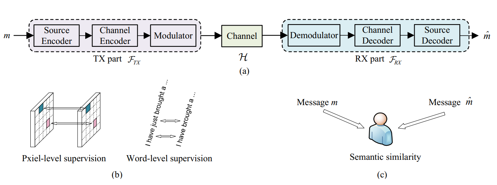

# SemanticRL



**SemanticRL is designed to preserve the semantic information instead of strictly securing the bit-level precision. It enables a general-purpose, large-scale, wireless, and semantic communication framework.**

## Features
+ A schematic shift from bit-precision to semantic consistency.
+ Compatible with any (non-differenable) semantic similarity metric as the objective function.
+ RL-based end-to-end optimization on non-differentiable and unknown wireless channel with high-dimensional action/semantic space.


## Requirements
```
pip install -r requirements.txt
```


## Dataset Preparation
```
cd $your_data_root
wget https://www.statmt.org/europarl/v7/fr-en.tgz
tar -zxvf fr-en.tgz    
python preprocess_captions.py --data_root $your_data_root
```


## Training

### Training SemanticRL-JSCC

```
# AWGN-CE-Stage1
python Trainng_SemanticRL.py --training_config ./config/config_AWGN_CE.yaml --dataset_path $your_data_root

# AWGN-CE-Stage2
python Trainng_SemanticRL.py --training_config ./config/config_AWGN_CE_Stage2.yaml --dataset_path $your_data_root

# AWGN-RL-Stage2
python Trainng_SemanticRL.py --training_config ./config/config_AWGN_RL.yaml --dataset_path $your_data_root
```

You can change the type of random channel to trian and test in different scenarios. For more details, run `python Trainng_SemanticRL.py --help`.


### Training SemanticRL-SCSIU
```
python Trainng_SemanticRL.py --training_config ./config/config_AWGN_RL_SCSIU.yaml --dataset_path $your_data_root
```

## Inference

Download the pretrained model. Place them into the root directory.

[Baidu Netdisk](https://pan.baidu.com/s/1wJ8ZFXyGugnqK1r_DhDkCw) extraction code: `fp3t`
 

```
SemanticRL
├── ckpt_AWGN_CE_Stage2
│   └── all checkpoints
├── ckpt_AWGN_RL 			  (the second version, see arXiv. trained with shuffle=True)
├── ckpt_AWGN_RL_SemanticRLv1 (the first version, see arXiv. trained with shuffle=False)
├── Evaluation
│   └── Inference_Given_Input.py
│   └── Run_Inference_Checkpoints.py
│   └── ...
├── Trainng_SemanticRL.py
├── ...
```	

**Reproducing Quantitative Results**

```
# Step1. load checkpoint and run inference on test set. 
# Output dir: ./Evaluation/InferenceResutls/$EXP_NAME/xxx.json (output tokens inside)
python Evaluation/Run_Inference_Checkpoints.py --path $CKPT_PATH --name $EXP_NAME --data_root $your_data_root
# Step2. calculate metrics like BLEU, CIDER etc.
# Output dir: ./Evaluation/EvalResults/$EXP_NAME/xxx.json (scores inside)
python Evaluation/CaptionMetrics-master/Eval_Metric_Checkpoints.py --path Evaluation/InferenceResutls/$EXP_NAME --name $EXP_NAME
```

**Reproducing Visual Results**

```
# Output dir: std output (i.e., your screen) (sentences of type str)
python Evaluation/Inference_Given_Input.py
```

Your trained model may behave a little different from ours, but they should be similar.


## Integrating SemanticRL with your own framework

Besides `LSTM` backbone, we provide a `Transformer` backbone to facilitate further researches. You can rewrite methods in `model.py` to customize your own framework. SemanticRL is model-agnostic. You may also design any semantic similarity metric to build a customed communication system.


## Thanks

This repository is largely inspired by [ruotianluo's excellent captioning work](https://github.com/ruotianluo/ImageCaptioning.pytorch).


## Citation
```
@article{lu2021reinforcement,
  title={Reinforcement learning-powered semantic communication via semantic similarity},
  author={Lu, Kun and Li, Rongpeng and Chen, Xianfu and Zhao, Zhifeng and Zhang, Honggang},
  journal={arXiv preprint arXiv:2108.12121},
  url={https://arxiv.org/abs/2108.12121},
  year={2021}
}
```


